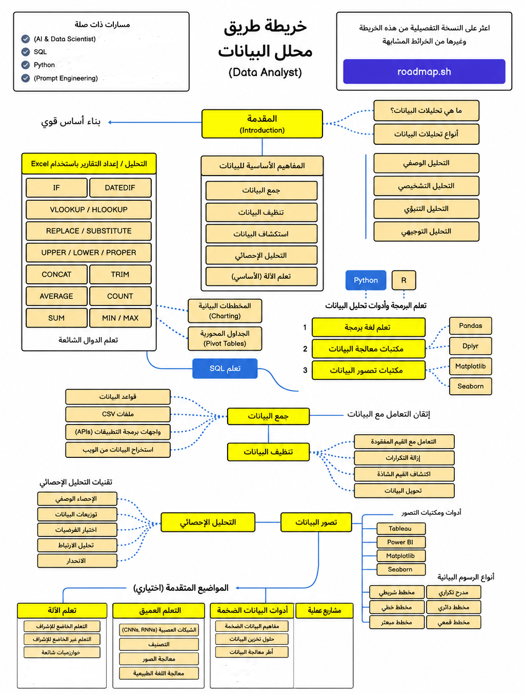

# مصادر تحليل البيانات بالعربي

جمعتلك هنا مصادر عربي كويسة لتعلم تحليل البيانات، مرتبة عشان تعرف تبدأ منين.

## يعني إيه تحليل البيانات؟

تحليل البيانات هو عملية فحص وتنظيم البيانات عشان نطلع منها معلومات واستنتاجات تساعدنا نفهم اللي حصل، ونعرف أسبابه، ونتوقع اللي ممكن يحصل بعد كده، وناخد قرارات مبنية على البيانات. المجال ده بيجمع بين الإحصاء، والبرمجة، والفهم العميق للمجال اللي بتشتغل فيه، عشان تقدر تطلع معنى حقيقي من بيانات منظمة أو حتى غير منظمة.

## مهمة محلل البيانات

محلل البيانات بيجمع البيانات، وينضفها، ويفسرها، عشان يجاوب على سؤال معين أو يحل مشكلة معينة.

### في ست خطوات لتحليل البيانات:

- تحديد المشكلة اللي عايز تحلها — **Business Question**
- جمع البيانات اللي محتاجها للتحليل — **Get Data**
- استكشاف البيانات بصريًا عشان تفهم إيه اللي موجود فيها — **Explore Data**
- تنظيف البيانات، وعمل الحقول المحسوبة، والتأكد من صحة البيانات — **Prepare Data**
- استخدام تقنيات تحليل البيانات عشان تفهمها وتفسرها وتوصل لاستنتاجات بناءً على المطلوب — **Analyze Data**
- عرض النتائج والاستنتاجات لأصحاب المصلحة — **Present Findings**

دلوقتي وانت عارف الخطوات، دي خريطة الطريق اللي هتوريك تتعلم إيه بالترتيب.

## خريطة طريق تعلم تحليل البيانات

---
## 🛠️ الأدوات

<a href="tools/excel/README.md">
  
اكسيل: أساسيات التعامل مع البيانات، الصيغ، والجداول المحورية (Pivot Tables). غالبًا أول أداة هيتعامل معاها أي حد بيبدأ.
</a>

  

<a href="tools/sql/README.md">
  
إس كيو إل: لغة استرجاع البيانات من قواعد البيانات، وكتابة الاستعلامات (Queries)، والـ Joins.
</a>

  

<a href="tools/power-bi/README.md">
  
باور بي آي: بناء لوحات تحكم (Dashboards) وتصورات بصرية تساعدك تعرض نتائج التحليل بشكل واضح.
</a>

  

<a href="tools/python/README.md">
  
بايثون: التحليل البرمجي للبيانات، الأتمتة، والتعامل مع بيانات أكبر وأعقد.
</a>

  

<a href="tools/statistics/README.md">
   
الإحصاء: الأساسيات الإحصائية اللي بتدي معنى حقيقي للتحليل، وتساعدك تفهم البيانات مش بس تشوفها.
</a>

---

## 📚 مصادر عامة في تحليل البيانات

### 📖 كتب
- [Python for Data Analysis (3rd Edition)](https://amzn.to/48jSwj7) by Wes McKinney 
- [SQL for Data Analysis](https://a.co/d/63MeilT) by Cathy Tanimura
- [Practical Statistics for Data Scientists (2nd Edition)](https://a.co/d/1YkZaab) by Peter Bruce, Andrew Bruce, Peter Gedeck
- [Essential Math for Data Science](https://a.co/d/iIWzb5C) by Thomas Nield
- [Modern Data Analytics in Excel](https://a.co/d/6Wld3qf) by George Mount
- [Excel 365 Bible](https://a.co/d/gZPOpZJ) by Michael Alexander, Dick Kusleika
- [The Definitive Guide to DAX](https://a.co/d/b90GT5B) by Marco Russo, Alberto Ferrari
- [Master Your Data with Power Query in Excel and Power BI](https://a.co/d/0dCssYI) by Miguel Escobar, Ken Puls

### 📝 مقالات

- [هل استخدام ChatGPT في تحليل البيانات ممكن يكون مخاطرة؟](https://www.businessinsider.com/leaders-shouldnt-use-chatgpt-for-data-analytics-2023-7)
## ⏰ ابدأ من هنا

محتاج بيانات حقيقية تتدرب عليها؟ شوف **مصادر تلاقي منها Datasets مجانية وعامة**.

- [Datahub](https://datahub.io/collections)
- [Dataset Search](https://datasetsearch.research.google.com/) 
- [Kaggle](https://www.kaggle.com/datasets) 
- [Data Gov](https://data.gov/)
- [Maven Analytics Data Playground](https://www.mavenanalytics.io/data-playground)
- [Awesome Public Datasets](https://github.com/awesomedata/awesome-public-datasets)
- [Datacamp Datasets](https://www.datacamp.com/workspace/datasets)
- [NASA Data](https://data.nasa.gov/)
- [Google BigQuery](https://cloud.google.com/bigquery/docs/sandbox)

### YouTube Channels

- [Alex the Analyst](https://www.youtube.com/c/AlexTheAnalyst)
- [Tina Huang](https://www.youtube.com/channel/UC2UXDak6o7rBm23k3Vv5dww/featured) 
- [Luke Barousse](https://www.youtube.com/c/LukeBarousse)
- [Ken Jee](https://www.youtube.com/@KenJee_ds/featured)
- [sqlbelle](https://www.youtube.com/c/sqlbelle)

### LinkedIn Creators

- [Danny Ma](https://www.linkedin.com/in/datawithdanny/) 
- [Avery Smith](https://www.linkedin.com/in/averyjsmith/) 
- [Albert Bellamy](https://www.linkedin.com/in/bellamy-al/) 

### Specific Courses

- [Data Analyst Bootcamp (Free)](https://youtube.com/playlist?list=PLUaB-1hjhk8FE_XZ87vPPSfHqb6OcM0cF) from [Alex the Analyst](https://www.youtube.com/@AlexTheAnalyst) 
- [Google Data Analytics Course](https://grow.google/dataanalytics/#?modal_active=none) 
- [Data with Danny Serious SQL Course](https://www.datawithdanny.com/courses/serious-sql) from [Danny Ma](https://www.datawithdanny.com/)

### Course Platforms

- [Coursera](https://www.coursera.org/)
- [Maven Analytics](https://www.mavenanalytics.io/) 

## 🖥️ المساهمة

لو عندك مصدر مجاني ومفيد لتعلُّم تحليل البيانات شايف إنه يستاهل يكون هنا، شاركه معانا.

تقدر تعمل **Pull Request (PR)** وتضيف المصدر، وهنراجعه ونضيفه للتجميعة لو مناسب.
> 🗓️ **آخر تحديث:** يوليو 2026

